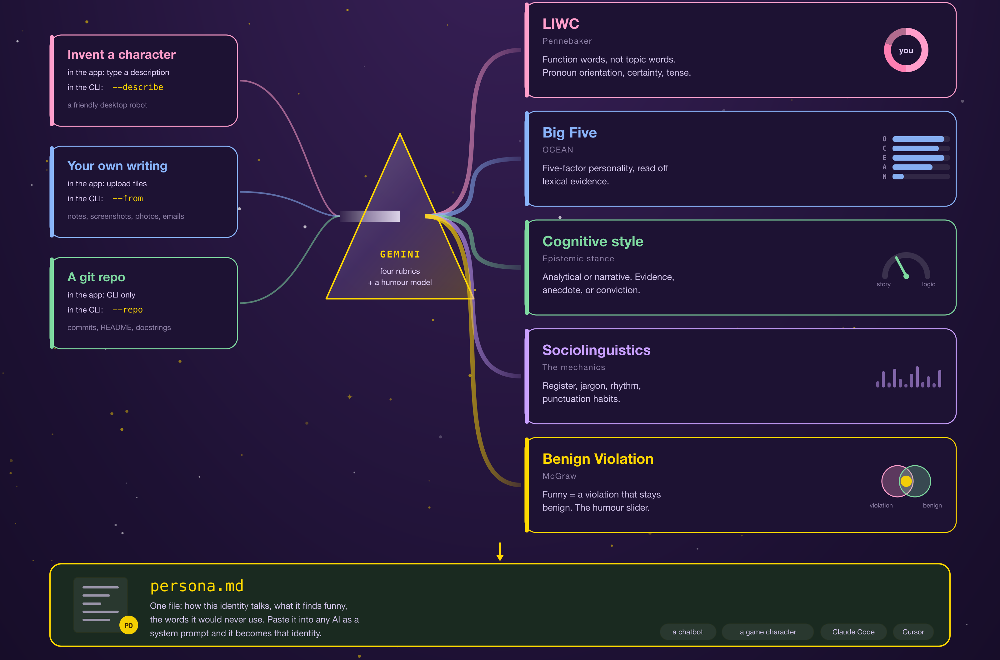
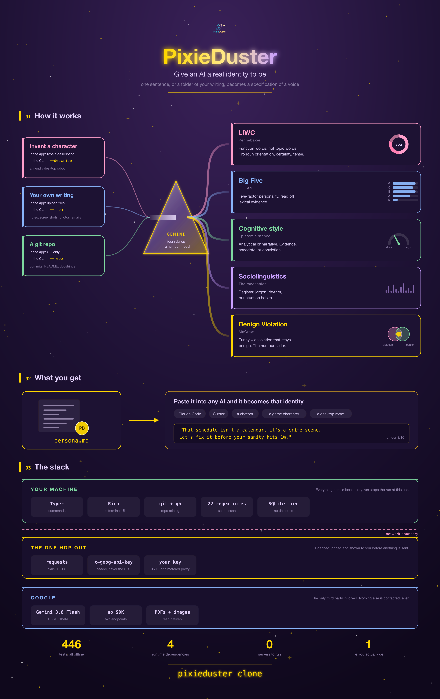

# PixieDuster

**Give an AI a real identity to be.** One sentence, or a folder of your writing,
becomes a full specification of a voice — which an AI then writes in.

[**Try it in the browser**](https://huggingface.co/spaces/gretchenboria/PixieDuster) ·
no sign-up, no API key, nothing to install.



## What it actually does

Point it at a folder of your own writing — photos of handwritten notes,
screenshots of text messages, saved emails, old essays, a chat log. Or skip the
evidence entirely and describe a character in a sentence.

It asks you three questions about the things writing can't reveal on its own,
then measures the voice against four empirical rubrics and a theory of humour,
and writes the result to a single file. Paste that file into any AI and it
becomes that identity.

```
"That schedule isn't a calendar, it's a crime scene.
 Let's fix it before your sanity hits 1%."
```

That's a desktop robot generated from one sentence, with the humour dial at 8.

## The command line version

```bash
pip install https://gretchenboria-pixieduster.static.hf.space/pixieduster-0.1.0-py3-none-any.whl
pixieduster login          # free, uses your Hugging Face account

pixieduster clone --from ~/my-writing
pixieduster clone -d "a friendly desktop robot with great humor"
pixieduster clone --repo .          # advanced: read a git repository
```

Then `pixieduster chat` to talk to what you made, or
`pixieduster diff draft.md` to ask whether something you wrote sounds like you.

## What it measures

Not vibes. Four empirical rubrics plus one theory of humour:

| | |
|---|---|
| **LIWC** (Pennebaker) | Function words rather than topic words — pronoun orientation, certainty vs hedging, temporal focus. The basis of forensic authorship work. |
| **The Big Five** (OCEAN) | Openness, Conscientiousness, Extraversion, Agreeableness, Neuroticism, read off lexical evidence. |
| **Cognitive style** | Analytical or narrative? Reasoning from evidence, anecdote, or conviction? |
| **Sociolinguistics** | Register, jargon, syntactic rhythm, punctuation habits — the involuntary tells. |
| **Benign Violation** (McGraw) | Funny is a violation that stays benign. This is what the humour slider sets. |

## Your writing, and where it goes

Your samples are sent to Google's Gemini API to be analysed. That is the
product, not a side effect — so it is made visible rather than hidden:

- `--dry-run` prints the exact payload and sends nothing at all.
- Every send is scanned first against 22 secret-detection rules — AWS keys,
  GitHub tokens, PEM blocks, connection strings with inline credentials.
- `--scrub` redacts anything found; otherwise you are asked.
- `.gitignore` is respected, and nothing outside the folder you name is read.

Secret detection is best-effort pattern matching, not a guarantee. Look at the
`--dry-run` output before pointing this at anything sensitive.

## Free tier

The hosted service runs on one shared key with hard limits: 5 personas a day per
Hugging Face account, 2 for anonymous browser visitors, under a global daily
ceiling. Past that, bring your own key with `--api-key`, or set one once with
`pixieduster config set-key`.

## The whole thing on one page



## Layout

| Path | What it is |
|---|---|
| `pixieduster/` | The CLI |
| `worker/` | Cloudflare Worker — the metered Gemini proxy |
| `web/` | The browser app, exactly as deployed to Hugging Face Spaces |
| `docs/` | The poster, quick start, and architecture reference |
| `tests/` | 446 tests, all offline — no API key required to run them |

## Requirements

Python 3.11+. `gh` is optional and only used for pull-request mining.
